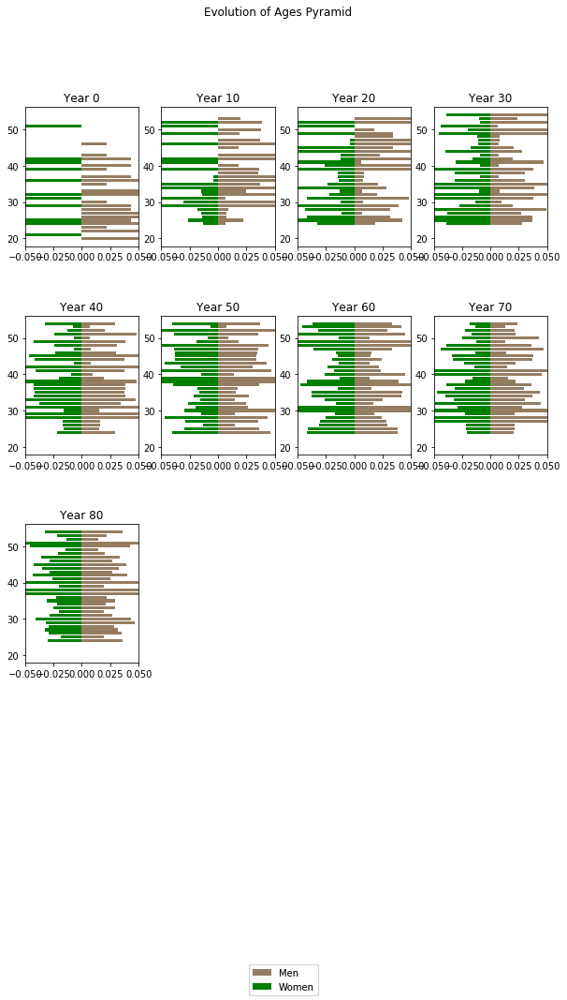

# Plotting Evolution of Ages pyramid over years


```python
# Import necessary packages
from pop_projection import Effectifs as eff
import pandas as pd
import numpy as np
import matplotlib.pyplot as plt
```


```python
# Define law of replacement
def law_replacement1(departures_, year_):
    
    '''
        assumes departures_ is a dic storing number of departures by group of the year year_
        returns a list of dics having keys : sex, age, number and group
        
    '''
    new_employees = []

    for g in departures_:
        temp = {'sex':'male', 'age' : 30, 'number': 0.25 * departures_[g],'group':g}
        new_employees.append(temp)
        temp = {'sex':'female', 'age' : 21, 'number': 0.25 * departures_[g],'group':g}
        new_employees.append(temp)
    
    return new_employees
```


```python
# Path for input data
path ="./pop_projection/data/"
```


```python
# Loading data
employees = pd.read_csv(path + "employees.csv",sep=";", decimal = ",")
spouses = pd.read_csv(path + "spouses.csv",sep=";", decimal = ",")
children = pd.read_csv(path + "children.csv",sep=";", decimal = ",")
```


```python
# Diplay some data
print('Employees :')
print(employees.head(10))
print('Spouses :')
print(spouses.head(10))
print('Children :')
print(children.head(10))
```

    Employees :
         id    type     sex familyStatus  age  Year_employment  group
    0   id1  active    male      married   28             2017      3
    1   id2  active    male      married   33             2003      3
    2   id3  active  female  not married   26             2017      4
    3   id4  active  female  not married   22             2017      4
    4   id5  active    male      married   26             2017      3
    5   id6  active    male      married   21             2017      3
    6   id7  active    male      married   20             2017      3
    7   id8  active    male      married   31             2017      3
    8   id9  active  female  not married   26             2017      4
    9  id10  active    male  not married   43             1997      1
    Spouses :
          id rang     sex  age   type familyStatus
    0  id301    1  female   72  widow  not married
    1  id302    1  female   71  widow  not married
    2  id303    1  female   68  widow  not married
    3  id304    1  female   76  widow  not married
    4  id305    1  female   77  widow  not married
    5  id306    1  female   64  widow  not married
    6  id307    1  female   71  widow  not married
    7  id308    1  female   66  widow  not married
    8  id309    1  female   73  widow  not married
    9  id310    1  female   73  widow  not married
    Children :
         id  rang     sex  age    type familyStatus
    0   id1     1  female    0  active  not married
    1   id2     1  female    0  active  not married
    2   id5     1  female    0  active  not married
    3   id6     1  female    0  active  not married
    4   id7     1  female    0  active  not married
    5   id8     1  female    0  active  not married
    6  id11     1  female    0  active  not married
    7  id12     1  female    0  active  not married
    8  id14     1  female    0  active  not married
    9  id16     1  female    0  active  not married
    


```python
# Projection of population
# Number of years to project
MAX_ANNEES = 100

# Projection
numbers_ = eff.simulerEffectif(employees, spouses, children, 'TV 88-90', MAX_ANNEES, law_replacement_ = law_replacement1)

# Getting individual numbers for employees (lives, deaths, resegnations, types)
ind_emp_numbers = eff.individual_employees_numbers(numbers_[0])

# Getting lives numbers of employees
employees_proj = ind_emp_numbers[0]

# Displaying some lines of lives numbers of employees
print(employees_proj.head(10))

```

         id    type     sex familyStatus  age  Year_employment  group  year_0  \
    0   id1  active    male      married  127             2017      3       1   
    1   id2  active    male      married  132             2003      3       1   
    2   id3  active  female  not married  125             2017      4       1   
    3   id4  active  female  not married  121             2017      4       1   
    4   id5  active    male      married  125             2017      3       1   
    5   id6  active    male      married  120             2017      3       1   
    6   id7  active    male      married  119             2017      3       1   
    7   id8  active    male      married  130             2017      3       1   
    8   id9  active  female  not married  125             2017      4       1   
    9  id10  active    male  not married  142             1997      1       1   
    
         year_1    year_2   ...      year_90  year_91  year_92  year_93  year_94  \
    0  0.979463  0.959318   ...     0.000000      0.0      0.0      0.0      0.0   
    1  0.989284  0.978593   ...     0.000000      0.0      0.0      0.0      0.0   
    2  0.979473  0.959348   ...     0.000000      0.0      0.0      0.0      0.0   
    3  0.979563  0.959535   ...     0.000000      0.0      0.0      0.0      0.0   
    4  0.979473  0.959348   ...     0.000000      0.0      0.0      0.0      0.0   
    5  0.979554  0.959535   ...     0.000000      0.0      0.0      0.0      0.0   
    6  0.979544  0.959516   ...     0.000014      0.0      0.0      0.0      0.0   
    7  0.989366  0.978824   ...     0.000000      0.0      0.0      0.0      0.0   
    8  0.979473  0.959348   ...     0.000000      0.0      0.0      0.0      0.0   
    9  0.988400  0.976791   ...     0.000000      0.0      0.0      0.0      0.0   
    
       year_95  year_96  year_97  year_98  year_99  
    0      0.0      0.0      0.0      0.0      0.0  
    1      0.0      0.0      0.0      0.0      0.0  
    2      0.0      0.0      0.0      0.0      0.0  
    3      0.0      0.0      0.0      0.0      0.0  
    4      0.0      0.0      0.0      0.0      0.0  
    5      0.0      0.0      0.0      0.0      0.0  
    6      0.0      0.0      0.0      0.0      0.0  
    7      0.0      0.0      0.0      0.0      0.0  
    8      0.0      0.0      0.0      0.0      0.0  
    9      0.0      0.0      0.0      0.0      0.0  
    
    [10 rows x 107 columns]
    


```python
# Title of individual plots
year = 'year_'

# Size of plot
plt.rcParams['figure.figsize'] = [10, 15]

for i in range(1, MAX_ANNEES//10):
    
    emp_grouped = employees_proj.groupby(['age','sex'], as_index=False)[year+str((i-1)*10)].sum()
    
    max_age = 55 # 101
    
    min_age = 19
    
    #update colum age to be age at year (i-1)*10
    emp_grouped['age'] = emp_grouped['age'] - MAX_ANNEES + (i-1)*10
    
    emp_grouped = emp_grouped.loc[(emp_grouped['age'] < max_age) & (emp_grouped['age'] > min_age)]
    
    table = pd.pivot_table(emp_grouped, values=year+str((i-1)*10), index=['age'],  columns=['sex'], aggfunc=np.sum)
    
    table = table.fillna(0)
    
    #calculate percentage
    if 'male' in list(table.columns):
        table['male'] = table['male']/np.sum(table['male'])
    if 'female' in list(table.columns):
        table['female'] = table['female']/np.sum(table['female'])
    
    if 'female' in list(table.columns):
        table['female'] = table['female'] * (-1)
    
    plt.subplot(4 , 4, i)
    plt.subplots_adjust(hspace = 0.5)
    plt.xlim(-0.05,0.05)
    plt.title('Year ' + str((i-1)*10))
    
    if 'male' in list(table.columns):
        values = [0] * (max_age - min_age - 1)
        for i in range(len(table['male'])):
            values[table.index[i] - min_age - 1] = table.iloc[i]['male']
        p_male = plt.barh(list(range(min_age + 1, max_age)), values, color = (149/255,125/255,98/255) )
    
    if 'female' in list(table.columns):
        for i in range(len(table['female'])):
            values[table.index[i] - min_age - 1] = table.iloc[i]['female']
        p_female = plt.barh(list(range(min_age + 1, max_age)), values, color = (0/255,128/255,0/255))

    plt.figlegend((p_male[0], p_female[0]), ('Men', 'Women'), loc = 'lower center')
    plt.suptitle('Evolution of Ages Pyramid')

# plt.show()
```




