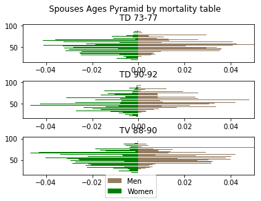

# Ages pyramid at year 50 for different mortality tables


```python
# Import necessary packages
from pop_projection import Effectifs as eff
import pandas as pd
import numpy as np
import matplotlib.pyplot as plt
```


```python
# Define law of replacement
def law_replacement1(departures_, year_):
    
    '''
        assumes departures_ is a dic storing number of departures by group of the year year_
        returns a list of dics having keys : sex, age, number and group
        
    '''
    new_employees = []

    for g in departures_:
        temp = {'sex':'male', 'age' : 30, 'number': 0.25 * departures_[g],'group':g}
        new_employees.append(temp)
        temp = {'sex':'female', 'age' : 21, 'number': 0.25 * departures_[g],'group':g}
        new_employees.append(temp)
    
    return new_employees
```


```python
# Define law of marriage
def law_mar1(age, sex, type):
    """
    Return the probability of getting maried  during the following year at a given age for a given sex

    """
    if sex == 'male':
        if type=='active':
            if age >= 25 and age <= 54:
                return 0.1
            else :
                return 0
        else:
            return 0
    
    if sex == 'female':
        if type=='active':
            if age >= 25 and age <= 54:
                return 0.15
            else :
                return 0
        else:
            return 0
```


```python
# Path for input data
path ="./pop_projection/data/"
```


```python
# Number of years to project
MAX_ANNEES = 100
```


```python
# Loading data
employees = pd.read_csv(path + "employees.csv",sep=";", decimal = ",")
spouses = pd.read_csv(path + "spouses.csv",sep=";", decimal = ",")
children = pd.read_csv(path + "children.csv",sep=";", decimal = ",")
```


```python
# Diplay some data
print('Employees :')
print(employees.head(10))
print('Spouses :')
print(spouses.head(10))
print('Children :')
print(children.head(10))
```

    Employees :
         id    type     sex familyStatus  age  Year_employment  group
    0   id1  active    male      married   28             2017      3
    1   id2  active    male      married   33             2003      3
    2   id3  active  female  not married   26             2017      4
    3   id4  active  female  not married   22             2017      4
    4   id5  active    male      married   26             2017      3
    5   id6  active    male      married   21             2017      3
    6   id7  active    male      married   20             2017      3
    7   id8  active    male      married   31             2017      3
    8   id9  active  female  not married   26             2017      4
    9  id10  active    male  not married   43             1997      1
    Spouses :
          id rang     sex  age   type familyStatus
    0  id301    1  female   72  widow  not married
    1  id302    1  female   71  widow  not married
    2  id303    1  female   68  widow  not married
    3  id304    1  female   76  widow  not married
    4  id305    1  female   77  widow  not married
    5  id306    1  female   64  widow  not married
    6  id307    1  female   71  widow  not married
    7  id308    1  female   66  widow  not married
    8  id309    1  female   73  widow  not married
    9  id310    1  female   73  widow  not married
    Children :
         id  rang     sex  age    type familyStatus
    0   id1     1  female    0  active  not married
    1   id2     1  female    0  active  not married
    2   id5     1  female    0  active  not married
    3   id6     1  female    0  active  not married
    4   id7     1  female    0  active  not married
    5   id8     1  female    0  active  not married
    6  id11     1  female    0  active  not married
    7  id12     1  female    0  active  not married
    8  id14     1  female    0  active  not married
    9  id16     1  female    0  active  not married
    


```python
# Mortality tables to use for plots
tables = ['TD 73-77', 'TD 90-92', 'TV 88-90']
```


```python
# some initialisations
year_ = 51
plot_num = 1
min_age_ = 19
max_age_ = 100
color_males = (149/255,125/255,98/255) 
color_females = (0/255,128/255,0/255)

for t in tables:

    # Projection of population
    numbers_ = eff.simulerEffectif(employees, spouses, children, t, MAX_ANNEES, law_replacement_ = law_replacement1, law_marriage_=law_mar1)

    # Pyramid of spouses
    ind_spo_numbers = eff.individual_spouses_numbers(numbers_[1])
    spouses_proj = ind_spo_numbers[0]
    
    emp_grouped = spouses_proj.groupby(['age','sex'], as_index=False)['year_'+str((year_-1))].sum()
        
    #update colum age to be age at year (year_-1)
    emp_grouped['age'] = emp_grouped['age'] - MAX_ANNEES + (year_-1)
    
    emp_grouped = emp_grouped.loc[(emp_grouped['age'] < max_age_) & (emp_grouped['age'] > min_age_)]
    
    table = pd.pivot_table(emp_grouped, values='year_'+str((year_-1)), index=['age'],  columns=['sex'], aggfunc=np.sum)
    
    table = table.fillna(0)
    
    #calculate percentage
    if 'male' in list(table.columns):
        table['male'] = table['male']/np.sum(table['male'])
    if 'female' in list(table.columns):
        table['female'] = table['female']/np.sum(table['female'])
    
    if 'female' in list(table.columns):
        table['female'] = table['female'] * (-1)
    
    plt.subplot(len(tables) , 1, plot_num)
    plt.subplots_adjust(hspace = 0.5)
    plt.xlim(-0.05,0.05)
    plt.title(t)
    
    if 'male' in list(table.columns):
        values = [0] * (max_age_ - min_age_ - 1)
        for i in range(len(table['male'])):
            values[table.index[i] - min_age_ - 1] = table.iloc[i]['male']
        p_male = plt.barh(list(range(min_age_ + 1, max_age_)), values, color = color_males )
    
    if 'female' in list(table.columns):
        for i in range(len(table['female'])):
            values[table.index[i] - min_age_ - 1] = table.iloc[i]['female']
        p_female = plt.barh(list(range(min_age_ + 1, max_age_)), values, color = color_females)
    plot_num += 1
    plt.figlegend((p_male[0], p_female[0]), ('Men', 'Women'), loc = 'lower center')

plt.suptitle('Spouses Ages Pyramid by mortality table')
plt.show()
```




